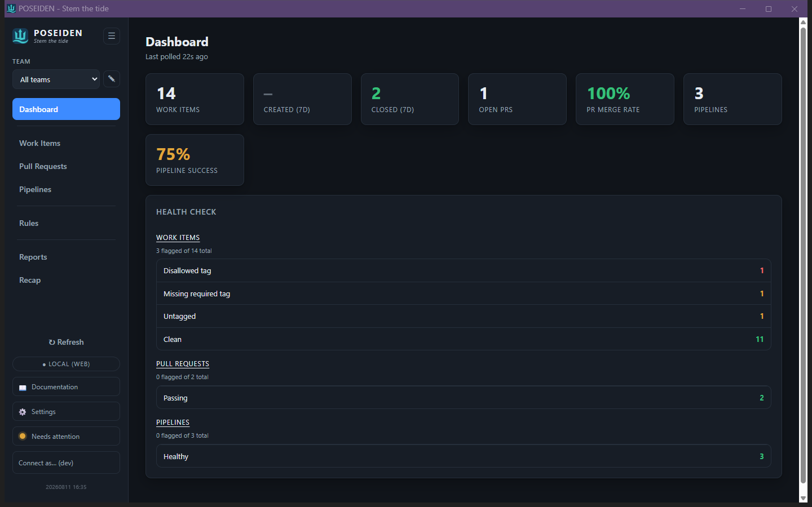

# Dashboard

The at-a-glance view: a row of headline counts and a **Health check** breakdown
of every hygiene flag across work items, pull requests, and pipelines. It answers
"what needs attention right now" - and every number links straight to the
filtered list behind it.

## GUI

The landing screen (hash route `#dashboard`). The header shows when the data was
last polled.

- **Stat tiles** - headline counts (work items, open/draft PRs, pipelines) plus
  rule-break rollups (flagged items / PRs / pipelines). Each tile is a link to
  its screen; the flagged tiles land pre-filtered to the rule-breaks. Tiles read
  green/amber/red by severity, and show a muted "–" (not a reassuring 0) before
  the first poll.
- **Health check** - a per-domain breakdown of the flags: Work items, Pull
  requests, Pipelines, each with its flag counts coloured by severity (amber =
  warning, red = error) and a green "passing" count for the healthy remainder.
  Each heading links to its screen; each **row** drills in filtered to that one
  flag.
- **Not-polled state** - until the first successful poll, the tiles and
  breakdown show a neutral placeholder rather than claiming a clean backlog.

## CLI

The Dashboard has no dedicated command - it's a visual roll-up of signals the CLI
already exposes: `poseidon lint` (the same hygiene flags; see
[Work Items](work-items.md)) and `poseidon report` (flow; see
[Reports](reports.md)).

## Where things live

- **Counts + flags** - computed on read from the stored work items, PRs, and
  pipeline health, evaluated against each team's effective [Rules](rules.md).
- **Last polled** - a stored timestamp updated on each successful poll; drives
  the "polled vs never polled" distinction.

## See also

- [Work Items](work-items.md) · [Pull Requests](pull-requests.md) ·
  [Pipelines](pipelines.md) - where the flagged rollups link to.
- [Rules](rules.md) - what counts as a flag in the first place.
