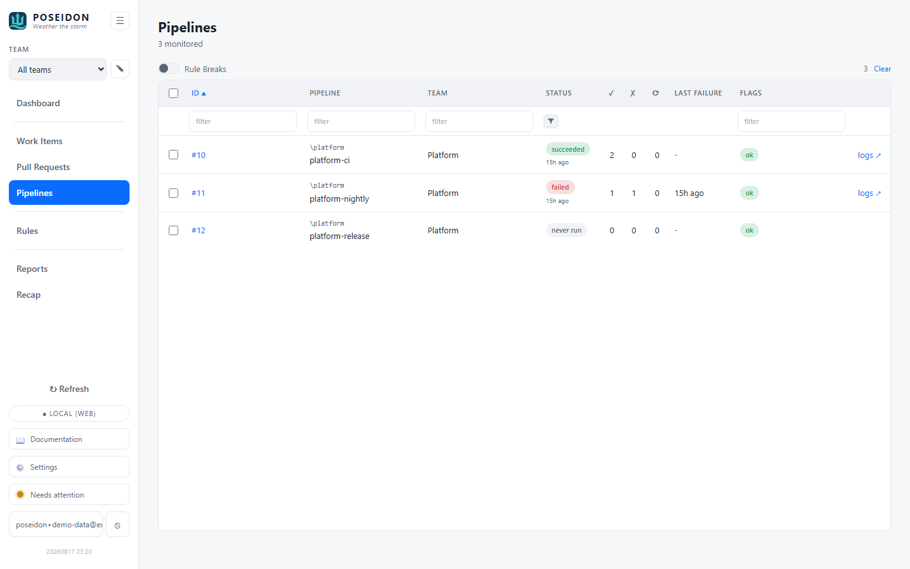

# Pipelines

Pipeline health at a glance - the most recent status of every monitored
pipeline, with flags for the ones that are failing or have never run. Keeps the
"is CI/CD green?" question one screen away.

## GUI

Open **Pipelines** from the sidebar (hash route `#pipelines`).

- **One row per pipeline** - id (links to the definition), name with its folder
  path (on Azure DevOps, the pipeline's virtual-folder path), team, last status,
  and when it last ran. Two pipelines can share a name, so the folder path
  disambiguates.
- **Last status, honestly** - the most recent completed run's result is fetched
  regardless of the recent-runs window, so a pipeline that last ran long ago
  shows its real status rather than a misleading "never run".
- **Hygiene flags** - per the team's pipeline [Rules](rules.md): **failing**
  (last run failed) and **never-run** (defined but never executed).
- **Logs link** - a quick link to the latest run's logs, separate from the id
  link (which opens the pipeline definition).
- **Rule Breaks toggle** - narrow to just the flagged pipelines; a Dashboard
  drill-in arrives pre-filtered.

## CLI

No dedicated command - pipeline **flow** is summarised by `poseidon report`
(runs, succeeded/failed, success rate; see [Reports](reports.md)). Per-pipeline
status is a GUI view.

## Where things live

- **Pipeline + run data** - polled from the provider's build APIs and stored
  locally; the last-status is folded in from the latest build so it survives the
  runs window.
- **Flags** - computed on read from the team's effective pipeline rules.

## See also

- [Reports](reports.md) - the success-rate aggregate over a date range.
- [Rules](rules.md) - the failing / never-run policy.
