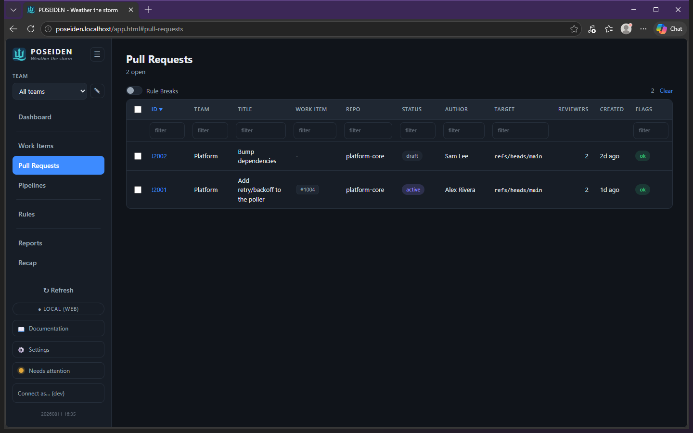

# Pull Requests

The pull requests in flight, each tied back to its work item(s), with PR-specific
hygiene flags. The counterpart to the PR chips on the [Work Items](work-items.md)
screen - here you look from the PR side.

## GUI

Open **Pull Requests** from the sidebar (hash route `#pull-requests`).

- **The active set** - the screen lists open (active) PRs. Completed and
  abandoned PRs are polled too, but only to colour the work-item link chips; they
  don't clutter this list.
- **Work-item chips** - the work item(s) each PR is linked to, as clickable
  chips that open the item in the provider. On **Azure DevOps** teams the links
  are editable - link/unlink a work item by id right on the row; GitHub and GitLab
  teams are read-focused, so their chips are view-only.
- **Status pill** - active / draft / completed / abandoned.
- **Hygiene flags** - evaluated against the team's PR [Rules](rules.md): a stale
  open/draft PR (older than the configured limit) and, by default, a PR with **no
  linked work item** (traceability).
- **Sort, filter, Rule Breaks toggle** - same table affordances as Work Items;
  the toggle (and a Dashboard drill-in) narrows to just the flagged PRs.

## CLI

No dedicated command yet - pull requests are a GUI view. PR **traceability**
(the "no linked work item" rule) is visible in the GUI and on the
[Dashboard](dashboard.md) Health check; a CLI surface may follow.

## Where things live

- **PR data** - polled from the provider's pull-/merge-request API and stored
  locally; the work-item ↔ PR links come from the work items' provider relations.
- **Link edits** - writing a work-item ↔ PR link goes back to Azure DevOps as an
  artifact-link relation on the work item. This write-back is Azure DevOps only;
  GitHub and GitLab links are read from the provider but not edited.
- **Flags** - computed on read from the team's effective PR rules.

## See also

- [Work Items](work-items.md) - the PR chips are the same links from the other side.
- [Rules](rules.md) - the PR staleness + require-work-item policy.
