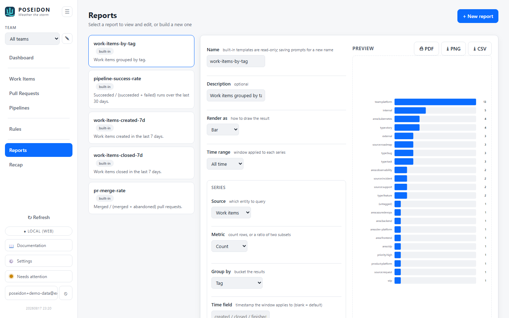

# Reports

A configurable report engine: pick a datasource, filter and group it, choose how
to reduce it to a number, and pick how to draw the result. It answers "are we
keeping up, and where is the work going?" over a window of time - the flow
counterpart to the point-in-time [Dashboard](dashboard.md).

The same engine backs the home screen's velocity tiles, so a tile and the report
behind it always agree.

## GUI

Open **Reports** from the sidebar (hash route `#reports`). The screen is a list of
reports on the left and an inline editor with a live preview on the right.



### Built-in reports

POSEIDON ships five built-in templates:

| Report | What it shows | Render |
|--------|---------------|--------|
| `work-items-by-tag` | Work items grouped by tag. | Bar |
| `pipeline-success-rate` | Succeeded / (succeeded + failed) runs, last 30 days. | Stat |
| `work-items-created-7d` | Work items created in the last 7 days. | Stat |
| `work-items-closed-7d` | Work items closed in the last 7 days. | Stat |
| `pr-merge-rate` | Merged / (merged + abandoned) pull requests. | Stat |

The last four back the [Dashboard](dashboard.md) velocity tiles - clicking a tile
deep-links straight to its report (`#reports?report=<name>`).

Built-ins are **read-only**: opening one shows its definition, but the save
control reads **Save as new...** and always writes a fresh, separately-stored copy
rather than overwriting the template.

### Building a report

Selecting a report (or **+ New report**) opens it in the editor. Every change
re-runs the preview after a short debounce, and a save control appears only once
the draft differs from what's stored.

A report is a **name**, a **render type**, a **time range**, and one or more
**series**:

| Field | Options |
|-------|---------|
| **Render as** | `Stat` (headline number), `Bar`, `Pie`, `Line`, `Table`, `Plain text`. |
| **Time range** | `All time`, or `Last N days`. Applied to every series. |

Each **series** describes one query over the data:

| Field | Options |
|-------|---------|
| **Source** | `Work items`, `Pull requests`, `Pipelines`, `Pipeline runs`. |
| **Metric** | `Count` (rows in the bucket), or `Ratio` (one subset over another, e.g. succeeded / terminal). |
| **Group by** | `None` (single total), `Tag`, `State`, `Status`, `Team`, `Work item type`, `Day`, `Week`. |
| **Filters** | Zero or more `field <op> value` conditions; ops are `=`, `≠`, `in`, `contains`. |
| **Time field** | Which timestamp the window applies to (e.g. work items by `created` vs `closed`). |

Add several series to overlay them (a `Line` or `Table` render draws one column /
line per series). Grouping by `Tag` fans a row out into one bucket per tag, with
untagged rows collected under `(untagged)`.

Saving a custom report persists it (per user - see [Setup](setup.md)); the
**Delete** action on its card removes it. Built-ins can't be deleted.

## CLI

`poseidon report` prints a fixed **flow summary** for a date range (default: the
last 30 days) from the stored data - work items opened/closed and pipeline run
outcomes. It is a standalone summary, not the configurable engine (that lives in
the GUI + HTTP API). Add `--poll` to refresh first.

```
%%%%%%%%%%%%%%%%%%%%%%%%%%%%%%%%%%%%%%%%%%
%%%%%%%%%%%%%%%%%%%#++%%%%%%%%%%%%%%%%%%%%
%%%%%%%%%%%%%%%%%%#+==+%%%%%%%%%%%%%%%%%%%
%%%%%%%%%%%%%%%%%#+====+%%%%%%%%%%%%%%%%%%
%%%%%%##%%%%%%%%#+======*%%%%%%%%%##%%%%%%
%%%%%%#=+#%%%%%%*++====++#%%%%%%#++#%%%%%%
%%%%%%#+==+#%%%%%%*====*%%%%%%#+==+%%%%%%%
%%%%%%%+====+#%%%%*====*%%%%#+====*%%%%%%%
%%%%%%%*====+#%%%%*====*%%%%*=====*%%%%%%%
%%%%%%%*====+#%%%%*====*%%%%#+====*%%%%%%%
%%%%%%%#====+#%%%%*====*%%%%#+====#%%%%%%%
%%%%%%%#====+#%%%%*====*%%%%#+====#%%%%%%%
%%%%%%%#====+#%%%%*====*%%%%#+===+#%%%%%%%
%%%%%%%#+===+#%%%%*====*%%%%#+===+#%%%%%%%
%%%%%%%#+========================+#%%%%%%%
%%%%%%%#+========================+#%%%%%%%
%%%%%%%%%%%#%%%%%%#+=========++++*%%%%%%%*
%%%%#*++========+*#%%#***#%%%%%%%%%%%%%#++
%#*=================+*#%%%%%%%%%%%%%%*==+#
+==*#########*+==========+*####**+=====*%%
%%%%%%%%%%%%%%%%%#+==================+%%%%
%%%%%%%%%%%%%%%%%%%%%*+==========+*#%%%%%%
%%%%%%%%%%%%%%%%%%%%%%%%%%####%%%%%%%%%%%%
            P O S E I D E N
          "Weather the storm"

Report 2026-07-01 → 2026-07-31

Work items:
  opened: 9
  closed: 3
  closed by tag:
    Internal                     2
    Technical Debt               1

Pipelines:
  runs: 22
  succeeded / failed / canceled: 17 / 5 / 0
  success rate: 77.3%
```

| Option | Description |
|--------|-------------|
| `--from <YYYY-MM-DD>` | Range start. Defaults to 30 days ago. |
| `--to <YYYY-MM-DD>` | Range end. Defaults to today. |
| `--poll` | Poll fresh before reporting (otherwise uses stored data). |
| `--team <name>` | Scope to one team; omit for all teams. |
| `--json` | Emit the report as JSON (banner suppressed). |

## Where things live

- **Engine** - a pure function over the loaded rows (`poseidon-reports`): the
  service loads the sources a spec references, hands them to the engine, and gets
  back one series of points per query. No separate report store for the data
  itself; it is computed from the same work items, PRs, pipelines, and runs the
  rest of the app polls.
- **Report definitions** - built-ins are code-defined and read-only; custom
  reports are persisted per user alongside the rest of that user's config.
- **Success / merge rate** - a `Ratio` metric counts a numerator subset over a
  denominator subset, so non-terminal rows (a running build, an open PR) sit in
  neither and don't skew the percentage.

## See also

- [Dashboard](dashboard.md) - the point-in-time counterpart, whose tiles run
  these reports.
- [Pipelines](pipelines.md) - the per-pipeline detail behind the success rate.
- [Work Items](work-items.md) - the backlog the work-item reports draw from.
