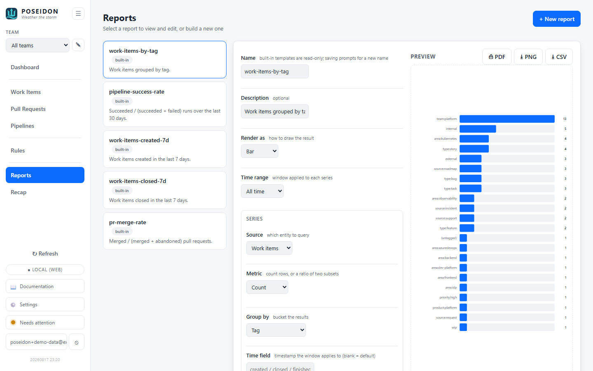

# Reports

A configurable report engine: pick a datasource, filter and group it, choose how
to reduce it to a number, and pick how to draw the result. It answers "are we
keeping up, and where is the work going?" over a window of time - the flow
counterpart to the point-in-time [Dashboard](dashboard.md).

The same engine backs the home screen's velocity tiles, so a tile and the report
behind it always agree.

## GUI

Open **Reports** from the sidebar (hash route `#reports`). The screen is a list of
reports on the left and an inline editor with a live preview on the right.



### Built-in reports

POSEIDON ships eight built-in templates:

| Report | What it shows | Render |
|--------|---------------|--------|
| `work-items-by-tag` | Work items grouped by tag. | Bar |
| `pipeline-success-rate` | Succeeded / (succeeded + failed) runs, last 30 days. | Stat |
| `work-items-created-7d` | Work items created in the last 7 days. | Stat |
| `work-items-closed-7d` | Work items closed in the last 7 days. | Stat |
| `pr-merge-rate` | Merged / (merged + abandoned) pull requests. | Stat |
| `pr-contributors` | Pull requests per person: opened, merged, abandoned, open now, merge rate, median days to merge, reviews given. Last 30 days. | Table |
| `work-items-created-by-person` | Work items created per team member, last 30 days. | Bar |
| `work-items-created-by-user` | Every work item created in the window with who created it; pick a person to narrow to one user. | Item list |

The four before `pr-contributors` back the [Dashboard](dashboard.md) velocity tiles - clicking a tile
deep-links straight to its report (`#reports?report=<name>`).

Built-ins are **read-only**: opening one shows its definition, but the save
control reads **Save as new...** and always writes a fresh, separately-stored copy
rather than overwriting the template.

### Work items created (per person, and as a list)

Two built-ins answer "who is raising work?" for the people on the team (the same roster as the contributor report below):

- `work-items-created-by-person` is a bar chart of work items created per team member in the window.
- `work-items-created-by-user` is a table of every work item created in the window, newest first: ID (linked to the tracker), type, state, created date, who created it, who it is assigned to, and title. A **Created by** picker above the table narrows it to one person (it lists whoever appears in the results), and **CSV** exports what is on screen. For "everything since a date", change the time range to **Between dates** in the editor and use **Save as new...** to keep it.

Creator comes from the tracker (Azure DevOps `Created By`, GitHub issue author, GitLab issue author) and is recorded on the next poll, so existing items gain it after one refresh. Reports cover the work items Poseidon polls for each team (its project and area path); items a person created in other projects or areas are not included. Build bots are left out, and a work item polled by two teams is counted once in the all-teams view.
### Contributor activity (pull requests per person)

`pr-contributors` answers "how active is each person?" with one table row per author and a column per measure, over the last 30 days (change *Last N days* in the editor and the preview re-runs; **Save as new...** keeps your version):

| Column | Meaning |
|--------|---------|
| **Opened** | PRs created in the window. |
| **Merged** / **Abandoned** | PRs completed / abandoned in the window - counted on the *close* date, so a PR opened last quarter and merged this week counts as merged. |
| **Open now** | PRs still open, however old (ignores the window). |
| **Merge rate** | Merged / (merged + abandoned) among PRs closed in the window. |
| **Median days to merge** | Median of creation-to-merge over PRs merged in the window. |
| **Reviews given** | PRs opened in the window that the person voted on (approve, suggestions, waiting, reject) - not their own, and not a reviewer who never voted. |

A **Total** row sums the count columns. Build bots and service accounts (e.g. a `Build Service`) are left out, and when two teams poll the same project a PR is only counted once in the all-teams view.

**Who counts as the team:** only people who belong to it. For Azure DevOps teams Poseidon reads the team's own member roster (Project settings > Teams > your team) on every poll, so there is nothing to configure. People are matched on their sign-in as well as display name, so a roster name that differs from the one on their PRs (`Jonathan` vs `Jon`) still matches. A project-wide feed therefore doesn't drag in one-off contributors from other teams, and the team-wide merge rate is unaffected. To override the roster (a tracker with none, or a deliberate subset), list people under **Team members override** when editing the team, or set `members` on the team in the config / tenant import YAML (names or sign-ins, matching ignores case). An explicit list always wins. A team with neither a roster nor a list shows everyone, and in the all-teams view the teams' people are combined unless some team has neither. Groups on a roster (a nested Entra group) are not expanded - list those people in the override.

**History:** Azure DevOps pulls PRs *closed* in the last 90 days (paged, so busy projects aren't truncated); GitHub and GitLab pull the most recent page of closed PRs, so a very busy repo can cover less than 30 days. GitHub and GitLab don't expose reviewer votes in the list call, so *Reviews given* stays empty there. Counts are a conversation starter rather than a score: they ignore PR size, pairing and review quality, which is why time-to-merge and reviews sit beside them.
### Building a report

Selecting a report (or **+ New report**) opens it in the editor. Every change
re-runs the preview after a short debounce, and a save control appears only once
the draft differs from what's stored.

A report is a **name**, a **render type**, a **time range**, and one or more
**series**:

| Field | Options |
|-------|---------|
| **Render as** | `Stat` (headline number), `Bar`, `Pie`, `Line`, `Table`, `Plain text`, `Item list` (one row per work item). |
| **Time range** | `All time`, `Last N days`, or `Between dates` (e.g. everything since 1 September). Applied to every series. |

Each **series** describes one query over the data:

| Field | Options |
|-------|---------|
| **Source** | `Work items`, `Pull requests`, `Pipelines`, `Pipeline runs`. |
| **Metric** | `Count` (rows in the bucket), `Ratio` (one subset over another, e.g. succeeded / terminal), or `Median days to close` (creation to merge/abandon). |
| **Group by** | `None` (single total), `Tag`, `State`, `Status`, `Team`, `Work item type`, `Day`, `Week`, and for people `Author / creator` (who opened a PR or created a work item) or, for pull requests, `Reviewer`. |
| **Filters** | Zero or more `field <op> value` conditions; ops are `=`, `≠`, `in`, `contains`. |
| **Time field** | Which timestamp the window applies to (e.g. work items or PRs by `created` vs `closed`). `any` ignores the window, e.g. "open right now". |

Add several series to overlay them (a `Line` or `Table` render draws one column /
line per series). Grouping by `Tag` fans a row out into one bucket per tag, with
untagged rows collected under `(untagged)`.

Saving a custom report persists it (per user - see [Setup](setup.md)); the
**Delete** action on its card removes it. Built-ins can't be deleted.

## CLI

`poseidon report` prints a fixed **flow summary** for a date range (default: the
last 30 days) from the stored data - work items opened/closed and pipeline run
outcomes. It is a standalone summary, not the configurable engine (that lives in
the GUI + HTTP API). Add `--poll` to refresh first.

```
%%%%%%%%%%%%%%%%%%%%%%%%%%%%%%%%%%%%%%%%%%
%%%%%%%%%%%%%%%%%%%#++%%%%%%%%%%%%%%%%%%%%
%%%%%%%%%%%%%%%%%%#+==+%%%%%%%%%%%%%%%%%%%
%%%%%%%%%%%%%%%%%#+====+%%%%%%%%%%%%%%%%%%
%%%%%%##%%%%%%%%#+======*%%%%%%%%%##%%%%%%
%%%%%%#=+#%%%%%%*++====++#%%%%%%#++#%%%%%%
%%%%%%#+==+#%%%%%%*====*%%%%%%#+==+%%%%%%%
%%%%%%%+====+#%%%%*====*%%%%#+====*%%%%%%%
%%%%%%%*====+#%%%%*====*%%%%*=====*%%%%%%%
%%%%%%%*====+#%%%%*====*%%%%#+====*%%%%%%%
%%%%%%%#====+#%%%%*====*%%%%#+====#%%%%%%%
%%%%%%%#====+#%%%%*====*%%%%#+====#%%%%%%%
%%%%%%%#====+#%%%%*====*%%%%#+===+#%%%%%%%
%%%%%%%#+===+#%%%%*====*%%%%#+===+#%%%%%%%
%%%%%%%#+========================+#%%%%%%%
%%%%%%%#+========================+#%%%%%%%
%%%%%%%%%%%#%%%%%%#+=========++++*%%%%%%%*
%%%%#*++========+*#%%#***#%%%%%%%%%%%%%#++
%#*=================+*#%%%%%%%%%%%%%%*==+#
+==*#########*+==========+*####**+=====*%%
%%%%%%%%%%%%%%%%%#+==================+%%%%
%%%%%%%%%%%%%%%%%%%%%*+==========+*#%%%%%%
%%%%%%%%%%%%%%%%%%%%%%%%%%####%%%%%%%%%%%%
            P O S E I D E N
          "Weather the storm"

Report 2026-07-01 → 2026-07-31

Work items:
  opened: 9
  closed: 3
  closed by tag:
    Internal                     2
    Technical Debt               1

Pipelines:
  runs: 22
  succeeded / failed / canceled: 17 / 5 / 0
  success rate: 77.3%
```

| Option | Description |
|--------|-------------|
| `--from <YYYY-MM-DD>` | Range start. Defaults to 30 days ago. |
| `--to <YYYY-MM-DD>` | Range end. Defaults to today. |
| `--poll` | Poll fresh before reporting (otherwise uses stored data). |
| `--team <name>` | Scope to one team; omit for all teams. |
| `--json` | Emit the report as JSON (banner suppressed). |

## Where things live

- **Engine** - a pure function over the loaded rows (`poseidon-reports`): the
  service loads the sources a spec references, hands them to the engine, and gets
  back one series of points per query. No separate report store for the data
  itself; it is computed from the same work items, PRs, pipelines, and runs the
  rest of the app polls.
- **Report definitions** - built-ins are code-defined and read-only; custom
  reports are persisted per user alongside the rest of that user's config.
- **Success / merge rate** - a `Ratio` metric counts a numerator subset over a
  denominator subset, so non-terminal rows (a running build, an open PR) sit in
  neither and don't skew the percentage.

## See also

- [Dashboard](dashboard.md) - the point-in-time counterpart, whose tiles run
  these reports.
- [Pipelines](pipelines.md) - the per-pipeline detail behind the success rate.
- [Work Items](work-items.md) - the backlog the work-item reports draw from.
