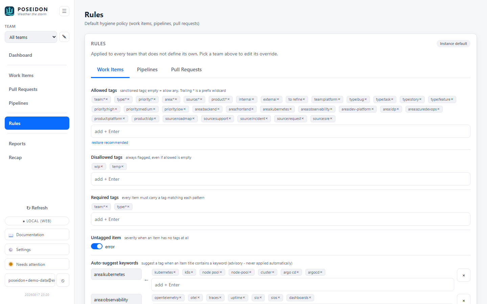

# Rules

The hygiene policy every flag is measured against - required/allowed/denied tags,
staleness limits, PR + pipeline checks - defined per team. Rules are **data, not
code**: POSEIDON never hard-codes a team's convention, so tuning the policy is a
config edit, no rebuild.

## GUI

Open **Rules** from the sidebar (hash route `#rules`). Rules are edited per team;
a team with no override inherits the instance default, and saving creates a
team-specific override.



The editor is tabbed by what the rules apply to:

- **Work Items** - allowed tags (empty = allow any; trailing `*` is a prefix
  wildcard), disallowed tags (always flagged), required tags (every item must
  match each), an **Untagged item** severity toggle (`untagged_is_error` - warn
  vs error when an item has no tags at all), **Auto-suggest keywords**
  (`tag_keywords` - per-tag keyword lists that drive deterministic, advisory tag
  suggestions when a keyword appears in the item), per-state staleness limits,
  **Resolved states** (`resolved_states` - which states count as done),
  **Stale-when-resolved tags** (`stale_when_resolved_tags` - work-in-progress
  tags that shouldn't remain on a resolved item), and ignored states/types
  (exempt from all checks).
- **Pipelines** - flag failing (last run failed) and flag never-run.
- **Pull Requests** - stale-open and stale-draft day limits, require a linked
  work item, and show-abandoned-links (`link_include_abandoned` - include
  abandoned PRs among a work item's linked-PR chips; off by default).

Edits apply live through the config store - no restart.

**Tag aliases / rewrites** - the ruleset also carries `tag_aliases`, legacy-tag ->
canonical-tag mappings (e.g. `SSA` -> `area:ssa`). A matching legacy tag produces a
*rewrite* suggestion on the Work Items screen - applying it drops the legacy tag
and adds the canonical one in a single edit. Like keyword suggestions these are
advisory and never applied automatically; they're set in config (`config import`).

## Flags

The rules engine emits these work-item hygiene flags (each advisory; the CLI's
`lint` maps `Error` severity to a non-zero exit):

- **untagged** - the item has no tags at all.
- **missing required tag** - an item lacks a tag the ruleset requires.
- **disallowed tag** - a tag not on the allow-list (or on the deny-list).
- **stale** - the item has sat in its current state longer than its per-state
  limit permits.
- **stale-state-tag** - a still-needs-work tag (e.g. "To Refine", "In Progress")
  left on an item in a resolved state. This is the one check that deliberately
  runs even on ignored states, and the Work Items screen offers a removal
  suggestion for the offending tag.

## CLI

Rules aren't edited from the CLI; they live in the database (edit them on the
Rules screen, or via `poseidon config import`) and are **enforced** by
`poseidon lint` (see [Work Items](work-items.md)). The ruleset:

```toml
[rules]
required_tags = []
allowed_tags = ["external", "internal", "blocked", "documentation", "technical debt"]
disallowed_tags = ["wip", "temp", "do-not-merge"]
untagged_is_error = false
ignore_states = []
ignore_types = []
# States that count as "done"; a "still needs work" tag here is flagged.
resolved_states = ["Closed", "Done", "Resolved", "Completed", "Removed"]
# Work-in-progress tags that shouldn't survive a resolved item.
stale_when_resolved_tags = ["to refine", "to do", "needs triage", "in progress", "blocked", "wip"]

# Deterministic tag suggestions: suggest the tag when a keyword appears (advisory).
[[rules.tag_keywords]]
tag = "documentation"
keywords = ["readme", "docs", "guide"]

# Legacy -> canonical rewrites: matching `from` suggests replacing it with `to`.
[[rules.tag_aliases]]
from = "SSA"
to = "area:ssa"

[rules.stale_days]
Active = 10
New = 21

[rules.pipelines]
flag_failing = true
flag_never_run = true

[rules.pull_requests]
stale_open_days = 14
stale_draft_days = 7
require_work_item = true
# Include abandoned PRs among a work item's linked-PR chips (off by default).
link_include_abandoned = false
```

A team overrides the default by adding its own `[team.rules]` table with the same
shape. Tag matching is case-insensitive; a trailing `*` is a prefix wildcard
(`type:*` matches `type:bug`).

## Where things live

- **Config** - stored per owner in the DB: an instance-default ruleset plus an
  optional per-team override. Edited on the Rules screen or via `config import`.
- **Engine** - the `poseidon-rules` crate interprets the rules; the same engine
  runs on read (GUI flags) and in `poseidon lint` (CLI), so they never drift.

## See also

- [Work Items](work-items.md) - where work-item flags surface + `poseidon lint`.
- [Pull Requests](pull-requests.md) · [Pipelines](pipelines.md) - the PR + pipeline checks.
- [Setup](setup.md) - teams, sign-in, and configuration.
