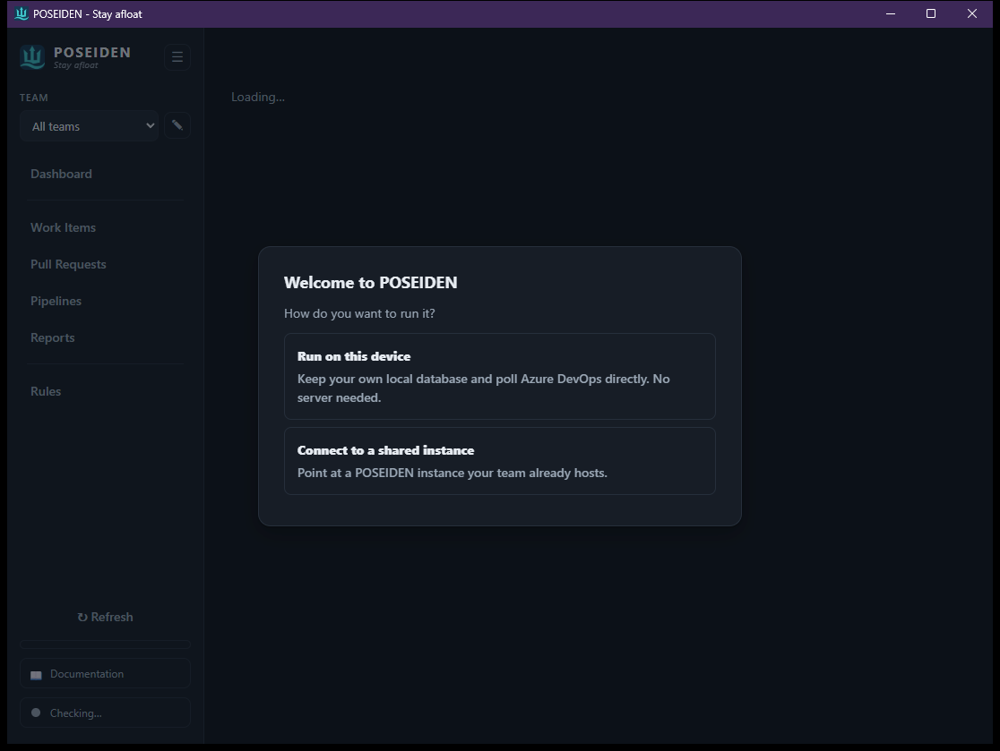
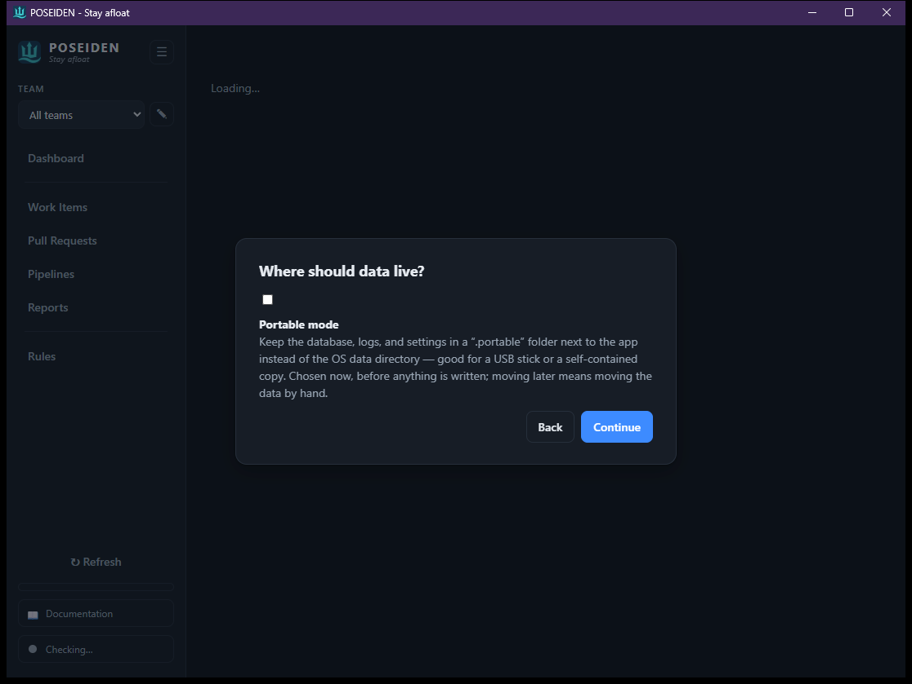
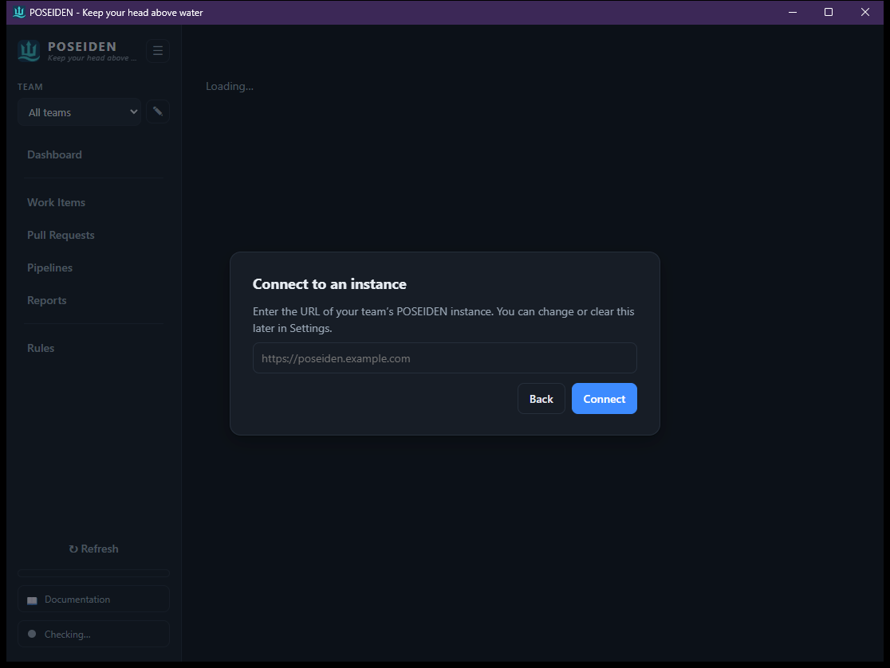
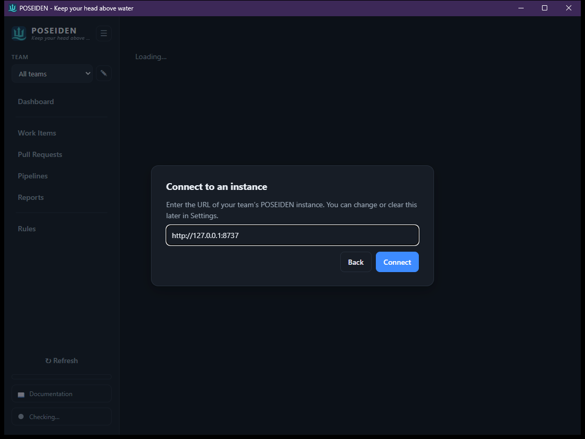

# Setup

Getting started: choose how to run POSEIDEN on first launch, then - if you're
running locally - connect your work tracker (Azure DevOps, GitHub, or GitLab),
define your team(s), and let the **Doctor** confirm everything's healthy. Once
configured, a background poll keeps the data fresh on its own.

## First run

On first launch POSEIDEN asks how you want to run it.



- **Run on this device** - a standalone local instance with its own embedded
  database, polling your work tracker directly. Nothing to host. You then choose
  where that data should live:

  

  Leave it unticked to use the OS data directory, or enable **Portable mode** to
  keep the database, logs, and settings in a `.portable` folder next to the app - 
  good for a USB stick or a self-contained copy. It's chosen once, before
  anything is written; moving later means moving the data by hand.

- **Connect to a shared instance** - point the client at a POSEIDEN instance your
  team already hosts. Enter its URL:

  

  

  The client reboots as a thin **remote** client of that instance (the sidebar
  badge reads *Remote instance*), sharing its database and its polling - no local
  sign-in or team setup needed, because the host handles that. You can change or
  clear the URL any time in Settings; clearing it returns to local mode.

The same frontend drives all of it - desktop, mobile, and the hosted web UI are
one codebase; "local" vs "remote" is a single stored setting, not a separate build.

### Demo mode

When POSEIDEN is served from a static host (its GitHub Pages site), the landing
page shows a **View Demo** button instead of the usual launch link. It opens the
app in a client-side **demo mode** (`app.html?demo=1`) backed by built-in sample
data - every read resolves from a shipped fixture and every write is a harmless
no-op - so you can click through every screen (including Recap) with **no backend
and no sign-in**. It's a try-before-you-host tour, not a way to connect real data.

## Connect your work tracker

Applies when you **run locally** (or when you administer the shared instance
everyone else connects to). POSEIDEN reads from three providers - **Azure DevOps,
GitHub, and GitLab** - and each team names the one it draws from. Reading, hygiene
flags, and reports work the same across all three; the inline write-backs (State /
Tags edits, work-item ↔ PR links) are **Azure DevOps only** - GitHub and GitLab
are read-focused.

### Adding a team

The team-management modal (edit icon by the scope selector) lets you add, edit,
and remove teams at runtime; changes persist to the database and take effect
without a restart. Every team has a **Team name** and a **Provider** dropdown -
Azure DevOps / GitHub / GitLab - and the rest of the form **adapts** to the
provider you pick:

- **Azure DevOps** - **Organization URL** (`https://dev.azure.com/your-org`) +
  **Project**, an optional **Area path** (with an *Include child boards* toggle:
  ticked scopes to the path's descendants, unticked is an exact-path match), and an
  **Entra tenant (for sign-in)**.
- **GitHub** - **Repository owner** (a user or org) + **Repository**.
- **GitLab** - **Namespace or base URL** (`gitlab-org`, or
  `https://gitlab.example.com` for a self-hosted server) + **Project path**.
- **All providers** - an optional **Token env var**: the *name* of an environment
  variable holding an access token. Public GitHub / GitLab repos need none - leave
  it blank to poll anonymously.

Team name plus the two provider-specific top fields (owner/org + repo/project) are
required; area path, tenant, and the token env var are optional.

### Signing in

- **Azure DevOps** authenticates with the Azure CLI **device-code** flow: it shows
  a code + URL, you complete the sign-in in your browser, and the token is brokered
  by `az` (no `localhost` listener, so it works on locked-down corporate networks).
  Alternatively a read-only PAT can be supplied via the team's **Token env var**
  (Work Items Read + Build Read is enough - don't grant more).
- **GitHub / GitLab** read **public** repos with no sign-in at all - leave the
  Token env var blank and POSEIDEN polls anonymously. For **private** repos (or to
  lift API rate limits), point the Token env var at a read-only access token.

### Doctor + scope

- **Doctor** - the health indicator (sidebar) runs checks in the background -
  provider reachability, auth, and an update check - and turns amber/red when
  something needs attention, with a panel explaining the fix. It's the home for
  the sign-in action when you're signed out.
- **Team scope selector** - switch between a single team and the "all teams"
  roll-up; the choice is remembered and applies across every screen.

## AI tag suggestions

Entirely **optional**. POSEIDEN can suggest tags with an AI model, but the
deterministic keyword/alias rules (see [Rules](rules.md)) work with no AI at all -
leave this unconfigured and everything else still runs.

Backends are configured in **Settings > LLM Integrations**, a reorderable priority
list: the first backend that is both supported on this platform and configured
wins. There are three backend kinds:

- **On-device embedded model** - runs in-process via `candle`. Choose a model
  (Qwen2.5 0.5B / 1.5B / 3B / 7B). CPU by default; builds with the `cuda` feature
  run it on an NVIDIA GPU. Private - no data leaves the machine.
- **In-browser (WebGPU)** - runs the model on your GPU inside the browser, no
  server GPU and no install. Experimental; needs a WebGPU-capable browser
  (Chrome/Edge). Larger models (e.g. 7B) suit a capable GPU.
- **Cloud providers** - Claude (Anthropic), OpenAI, or Gemini. Bring your own API
  key.

First-run onboarding includes an optional AI step; you can also add and reorder
backends later in Settings. A **Use work-item description** toggle (Settings > Tag
inputs) controls whether the item body - not just the title, type, and tags - is
sent to the tagger.

Suggestions are **advisory**: they're stored and then reviewed and applied by a
person on the Work Items screen, never auto-applied.

## CLI

`poseiden poll` runs one poll across every configured team and reports what it
fetched - handy for a first-run smoke test or a scheduled refresh. It uses the
same data directory as the app (`POSEIDEN_DATA_DIR`, or the portable `.portable`
folder).

```
%%%%%%%%%%%%%%%%%%%%%%%%%%%%%%%%%%%%%%%%%%
%%%%%%%%%%%%%%%%%%%#++%%%%%%%%%%%%%%%%%%%%
%%%%%%%%%%%%%%%%%%#+==+%%%%%%%%%%%%%%%%%%%
%%%%%%%%%%%%%%%%%#+====+%%%%%%%%%%%%%%%%%%
%%%%%%##%%%%%%%%#+======*%%%%%%%%%##%%%%%%
%%%%%%#=+#%%%%%%*++====++#%%%%%%#++#%%%%%%
%%%%%%#+==+#%%%%%%*====*%%%%%%#+==+%%%%%%%
%%%%%%%+====+#%%%%*====*%%%%#+====*%%%%%%%
%%%%%%%*====+#%%%%*====*%%%%*=====*%%%%%%%
%%%%%%%*====+#%%%%*====*%%%%#+====*%%%%%%%
%%%%%%%#====+#%%%%*====*%%%%#+====#%%%%%%%
%%%%%%%#====+#%%%%*====*%%%%#+====#%%%%%%%
%%%%%%%#====+#%%%%*====*%%%%#+===+#%%%%%%%
%%%%%%%#+===+#%%%%*====*%%%%#+===+#%%%%%%%
%%%%%%%#+========================+#%%%%%%%
%%%%%%%#+========================+#%%%%%%%
%%%%%%%%%%%#%%%%%%#+=========++++*%%%%%%%*
%%%%#*++========+*#%%#***#%%%%%%%%%%%%%#++
%#*=================+*#%%%%%%%%%%%%%%*==+#
+==*#########*+==========+*####**+=====*%%
%%%%%%%%%%%%%%%%%#+==================+%%%%
%%%%%%%%%%%%%%%%%%%%%*+==========+*#%%%%%%
%%%%%%%%%%%%%%%%%%%%%%%%%%####%%%%%%%%%%%%
            P O S E I D E N
          "Weather the storm"

Polled 2 team(s): 213 work items, 14 pipelines, 96 runs.
```

Sign-in itself is not a CLI subcommand - the CLI reuses whatever provider auth is
already present: an `az` session or a token env var. For Azure DevOps run
`az login` (or export the PAT) first; public GitHub / GitLab teams need nothing at
all. Then `poseiden poll`. Seed a data directory declaratively (CI, a fresh
instance, a new tenant) with `poseiden config import <bundle>.poseiden.import.yaml`
 - see the [tenant bundles](../../tenants/README.md).

| Option | Description |
|--------|-------------|
| `--json` | Emit the poll outcome as JSON (banner suppressed). |
| `--team <name>` | Scope `lint` / `report` to one team. |

## Where things live

- **Config** - no config file. Teams, rules, tags, and saved reports live in the
  **database** (per owner); back them up, share them, or seed them with `poseiden
  config export`/`import` (portable YAML bundles). Instance settings (bind/port/
  poll, telemetry) come from **env vars**.
- **Secrets** - a provider token is read from the environment variable named by
  the team's **Token env var** (Azure DevOps defaults to `POSEIDEN_AZURE_PAT`),
  never stored in config or the DB, never sent to the browser. Public GitHub /
  GitLab teams need no token at all.
- **Auth token** - an Azure DevOps device-code sign-in is brokered by `az`;
  POSEIDEN never persists it.

## See also

- [Rules](rules.md) - the hygiene policy, stored per team in the DB.
- [User Guide](user-guide.md) - portable mode, deployment, storage paths.
- [Running & debugging](../RUNNING.md) - dev workflow, minikube, the tenant bundles.
