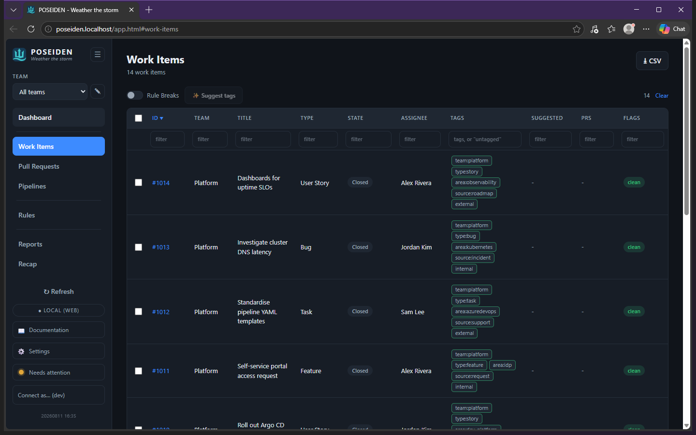

# Work Items

The backlog as a single, dense table - every polled work item across the
selected team(s), evaluated against the hygiene [Rules](rules.md) and editable
in place. This is where a Product Owner triages: sort, filter, spot the flagged
rows, and fix state or tags without leaving the app.

## GUI

Open **Work Items** from the sidebar (hash route `#work-items`).



- **One row per work item** - id (links to the provider), title, type, state,
  assignee, tags, linked PRs, and hygiene flags. Sorted newest-first by id. The
  same table backs every provider - Azure DevOps, GitHub, and GitLab.
- **Per-column sort + filter** - click a header to sort; type in a column's
  filter box to narrow. The **Tags** filter is smart: space/comma-separated
  terms are ANDed, and the keyword `untagged` matches items with no tags.
- **Tag chips are coloured by policy** - green outline = allowed, red = off the
  allow-list / on the deny-list, plain = neutral (no tag policy configured).
- **PR chips** show each linked pull request coloured by status (blue active,
  green merged, red abandoned, grey draft/unknown); click one to open it.
- **Inline editing** - click a **State** cell to pick a new state, a **Tags**
  cell to add/remove tag chips, or a **PRs** cell to link/unlink a PR by id.
  Edits write straight back to your work tracker and the row's flags recompute.
  Inline write-back is **Azure DevOps only** - GitHub and GitLab teams are
  read-focused, so their rows are for viewing (reading, flags, and suggestions all
  still work; the edit-back doesn't).
- **Rule Breaks toggle** - flip it to show only items that break a rule. Arriving
  from a Dashboard flag drills in pre-filtered to that one flag, with a clearable
  chip.
- **Selection + paging** - a checkbox column multi-selects (row-click also
  selects); page size is configurable in Settings (default 500).
- **Bulk retag** - while rows are selected, a bar appears above the table: type a
  tag and **Add tag** / **Remove tag** across the whole selection, or pick a state
  to **Set state** on all of them. It applies the same per-item write as an inline
  edit (one call per row, no-op rows skipped), asks for confirmation first, and
  reports how many updated. Selection persists across filtering, so a bulk apply
  hits every ticked row even if the filter hides some.
- **CSV export** - the **⭳ CSV** button in the page header exports the current
  filtered view (or, if any rows are ticked, just the selection) to a
  `work-items.csv` with columns: id, title, type, state, assignee, tags,
  suggestions, and flags. Handy for reviewing tag suggestions outside the app.

## Tag suggestions

A **Suggested** column sits between Tags and PRs, carrying advisory tag hints for
each row. Nothing here is ever applied automatically - every suggestion is a chip
a person clicks, and the change only reaches the provider on that explicit apply
(the same "explicit write-back only" rule the rest of the app follows). Suggestions
are computed for every provider; applying them writes back on Azure DevOps teams.

Suggestions combine two sources: a deterministic keyword/alias rules engine (no AI
needed) and an optional AI tagger. They surface as three chip types:

- **Add** (`+ tag`) - proposes adding a tag. Clicking it adds the tag to that row.
- **Rewrite** (`old → new`) - proposes replacing a legacy tag with its canonical
  form, driven by the ruleset's tag aliases / legacy-to-canonical rewrites.
  Applying it drops the legacy tag and adds the canonical one in a single edit.
- **Remove** (`- tag`) - proposes removing a tag, driven by the stale-state-tag
  rule (for example a "To Refine" or "In Progress" tag left on a resolved item).
  This chip exists because the add-only AI tagger cannot remove tags.

Clicking any chip stages that change on the row; it is written back to the
provider (Azure DevOps) only when you apply it.

### Running the AI tagger

A **✨ Suggest tags** action appears in the table toolbar once an AI backend is
configured (see the setup docs). Tick the rows you want, then run it over just
that selection - the current filter, sort, and selection are all preserved across
the run. Backends are chosen in Settings: an on-device or hosted embedded model
(the server does the inference), or in-browser WebGPU, which runs the model on
your own GPU. Whether the work-item body/description is fed to the tagger is
controlled by a **Use work-item description** toggle in Settings; by default the
tagger sees only the title, type, and current tags.

### Applying in bulk

While rows are selected, the bulk bar offers **✓ Apply suggestions**, which
applies every add and rewrite suggestion across the selected rows at once. It is
still a bounded, user-initiated set of edits over rows you hand-picked, not an
automatic backlog sweep - rewrites drop their legacy tag, and adds already present
are skipped.

## CLI

`poseiden lint` evaluates the same rules over the stored items and prints the
flags. It polls fresh first unless `--no-poll`, and **exits 1 if any
error-severity flag is found** - so it drops straight into CI as a backlog gate.

```
%%%%%%%%%%%%%%%%%%%%%%%%%%%%%%%%%%%%%%%%%%
%%%%%%%%%%%%%%%%%%%#++%%%%%%%%%%%%%%%%%%%%
%%%%%%%%%%%%%%%%%%#+==+%%%%%%%%%%%%%%%%%%%
%%%%%%%%%%%%%%%%%#+====+%%%%%%%%%%%%%%%%%%
%%%%%%##%%%%%%%%#+======*%%%%%%%%%##%%%%%%
%%%%%%#=+#%%%%%%*++====++#%%%%%%#++#%%%%%%
%%%%%%#+==+#%%%%%%*====*%%%%%%#+==+%%%%%%%
%%%%%%%+====+#%%%%*====*%%%%#+====*%%%%%%%
%%%%%%%*====+#%%%%*====*%%%%*=====*%%%%%%%
%%%%%%%*====+#%%%%*====*%%%%#+====*%%%%%%%
%%%%%%%#====+#%%%%*====*%%%%#+====#%%%%%%%
%%%%%%%#====+#%%%%*====*%%%%#+====#%%%%%%%
%%%%%%%#====+#%%%%*====*%%%%#+===+#%%%%%%%
%%%%%%%#+===+#%%%%*====*%%%%#+===+#%%%%%%%
%%%%%%%#+========================+#%%%%%%%
%%%%%%%#+========================+#%%%%%%%
%%%%%%%%%%%#%%%%%%#+=========++++*%%%%%%%*
%%%%#*++========+*#%%#***#%%%%%%%%%%%%%#++
%#*=================+*#%%%%%%%%%%%%%%*==+#
+==*#########*+==========+*####**+=====*%%
%%%%%%%%%%%%%%%%%#+==================+%%%%
%%%%%%%%%%%%%%%%%%%%%*+==========+*#%%%%%%
%%%%%%%%%%%%%%%%%%%%%%%%%%####%%%%%%%%%%%%
            P O S E I D E N
          "Weather the storm"

10 hygiene flag(s):
  [warn] #4208 (Payments) - item has no tags
  [warn] #4202 (Payments) - item has no tags
  [warn] #4202 (Payments) - stale: 70 days in "Active" (limit 10)
  [warn] #4206 (Payments) - tag "To Refine" is not on the allowed list
  [warn] #4206 (Payments) - stale: 140 days in "Active" (limit 10)
  [warn] #4109 (Platform) - tag "wip" is on the disallowed list
  [warn] #4103 (Platform) - item has no tags
  [warn] #4102 (Platform) - stale: 95 days in "Active" (limit 10)
  [warn] #4105 (Platform) - tag "To Refine" is not on the allowed list
  [warn] #4105 (Platform) - stale: 180 days in "Active" (limit 10)

0 error(s), 10 warning(s).
```

| Flag / option | Description |
|---------------|-------------|
| `--no-poll` | Evaluate the already-stored items without polling the provider first. |
| `--team <name>` | Scope to one team (the `[[team]]` `name`); omit for all teams. |
| `--json` | Emit the flags as JSON instead of the human list (banner suppressed). |

Exit code is `1` when any **error**-severity flag is present (e.g. a disallowed
tag when the ruleset marks it an error), else `0` - the CI-gating contract.

## Where things live

- **Data** - polled items are stored in the local SQLite DB (see the
  [User Guide](user-guide.md)); the table reads from there, not live per-render.
- **Policy** - which tags/states/staleness get flagged is all in the
  [Rules](rules.md), per team.
- **Edits** - State / Tags / PR-link edits go straight to the provider (Azure
  DevOps; GitHub and GitLab are read-only); POSEIDEN then re-reads the canonical
  result.

## See also

- [Rules](rules.md) - the policy behind every flag here.
- [Pull Requests](pull-requests.md) - the other end of the PR-link chips.
- [Dashboard](dashboard.md) - the flag rollups that link back into this table.
